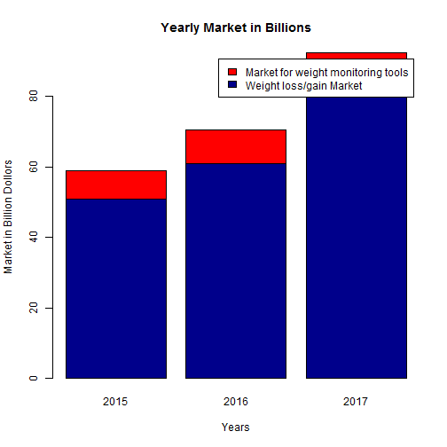
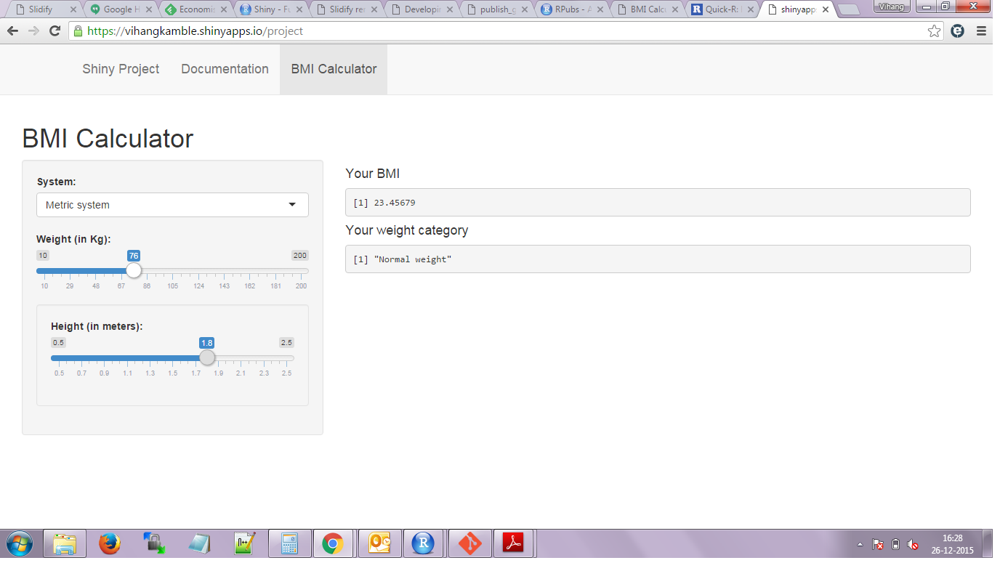

## Market Research

- Personal Health Market is exploding
- Figure shows the Total weight loss/gain Market and the share of weight monitoring tool

 

- Significant potential for weight monitoring tool like a BMI calculator

- This tool can be integrated with a wearable device which can store and monitor BMI over a duration

--- .class #id 

## App Features

- Weight maintenance programs tracks body mass index (BMI).
- BMI is defined as body mass divided by the square of the body height.
- BMI normalizes the body mass over different heights and it loosely gives a measure of a person's thinness or thickness
- BMI is mapped into various weight categories

--- .class #id 

## App Details

- This app takes following inputs
  - Measurement system: Metric or Imperial system
  - In Metric system input is 
      +  Weight in slider form in Kilograms
      +  Height in slider form in Meters
  - In Imperial system input is 
      + Weight in slider form in Lbs
      +  Height in slider form in Feet and Inches

--- .class #id 

## App Usage and Examples

- Following is the screen shot of the application

